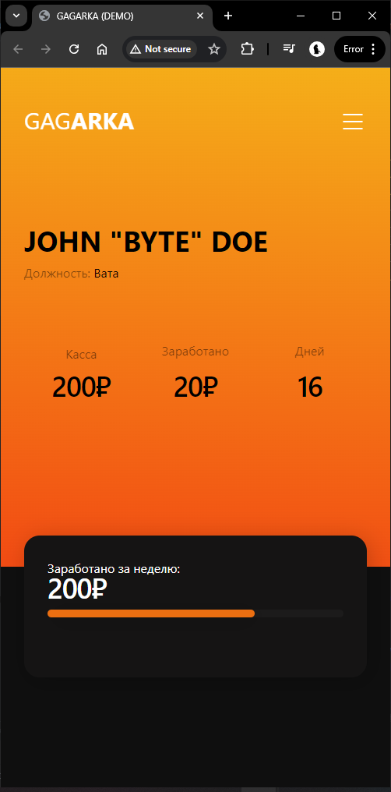
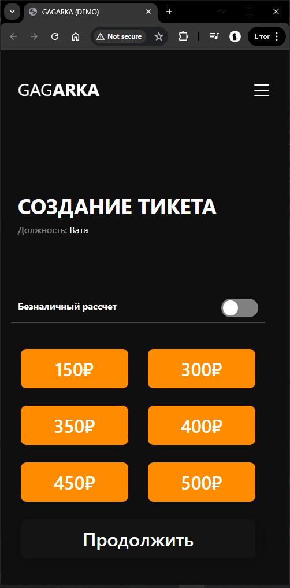

# GAGARKA — Система учета торговых точек

[](https://php.net)
[](https://mysql.com)
[](https://getbootstrap.com)

---

## 📌 О проекте

**GAGARKA** — система учета продаж и управления товарными остатками для торговых точек в курортном городе Яровое.

### Возможности
- 📝 Фиксация продаж через простой интерфейс с кнопками
- 💰 Раздельный учет наличных и безналичных платежей
- 📦 Управление складом и расходными материалами
- 📊 Статистика по каждому сотруднику и точке
- 👥 Управление персоналом (назначение ролей)
- 📈 Выгрузка отчетов в CSV

---
## 👨‍💻 Разработка

Проект написан **без использования искусственного интеллекта**. Весь код создан вручную с нуля.

- **Автор:** [BYTE]
- **Год создания:** 2024
- **Язык:** PHP, JavaScript, SQL
- **Архитектура:** MVC

---

## 🔄 Как работает

**Авторизация:** `/login` → ввод данных → проверка в БД → создание сессии

**Продажа:** нажатие кнопки → списание товара → сохранение заказа → обновление страницы

**Склад:** добавление/удаление товаров → обновление остатков → запись в логи

---





## 👥 Роли

| Действие | Сотрудник | Админ |
|----------|-----------|-------|
| Создание заказов | ✅ | ✅ |
| Своя статистика | ✅ | ✅ |
| Управление складом | ❌ | ✅ |
| Управление персоналом | ❌ | ✅ |
| Все заказы | ❌ | ✅ |
| Отчеты CSV | ❌ | ✅ |

---

## 📊 База данных

| Таблица | Поля |
|---------|------|
| `users` | id, nickname, password, type, admin, procent |
| `types` | id, title, storage |
| `items` | id, title |
| `storage` | id, item, count |
| `typeitems` | id, type, item, count |
| `orders` | id, type, user, count, beznal, item, createtime |
| `buttons` | id, type, count, item |
| `storelog` | id, user, point, item, count, createtime |

---

## 🔌 API

| Метод | Эндпоинт | Описание |
|-------|----------|----------|
| POST | `/api/login` | Авторизация |
| POST | `/api/addorder` | Создать заказ |
| POST | `/api/delorder` | Удалить заказ |
| POST | `/api/edititem` | Изменить товар |
| POST | `/api/addItemStorage` | Добавить на склад |
| POST | `/api/delItemStorage` | Удалить со склада |
| POST | `/api/addItemPoint` | Добавить в точку |
| POST | `/api/settype` | Сменить должность |
| GET | `/api/csv` | Скачать отчет |

---

## 🛠️ Технологии

- **Backend:** PHP 7.1+
- **Database:** MySQL 5.7+
- **Frontend:** Bootstrap 5, jQuery
- **Architecture:** MVC
- **Dependencies:** Composer

---

## 🚀 Установка

```bash
# 1. Клонировать репозиторий
git clone https://github.com/BYTEGTX/--GAGARKA.git

# 2. Установить зависимости
composer install

# 3. Настроить БД в config/db_params.php

# 4. Настроить виртуальный хост
